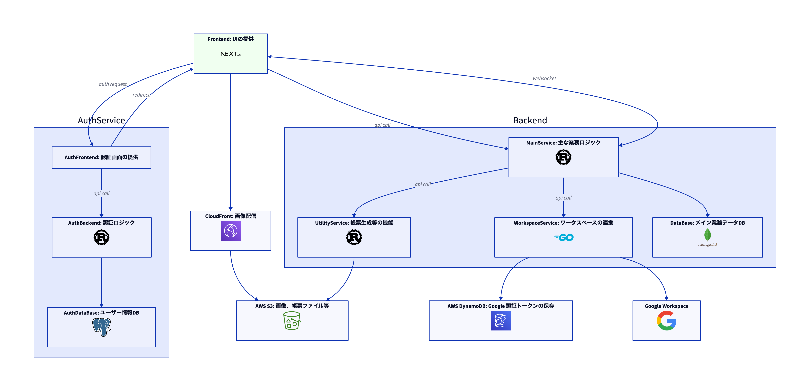

# OISM -- PH 店舗管理システム Frontend

## プレビュー

[](https://d14ua4d3ywmgu9.cloudfront.net/oism-cap-v1.mp4)

## システム概要

OSIM は EC ショップのバックオフィスに必要な機能をまとめて提供するサービスです。

### 主な機能

以下機能が含まれています

#### 注文管理

- 注文の受付
- 注文の状態管理

#### 在庫管理

- 入庫・出庫
- 履歴管理
- 倉庫間移動

#### 出荷管理

- 出荷の作成生
- 輸送ベンダー管理
- 輸送帳票生成

#### コラボレーション

- 複数ユーザ
- ユーザー間のリアルタイム情報更新

#### 外部連携

- Google Workspace への通知
- Google Workspace へのタスク割り当て

## システム構成

\*\* 図 Frontend 部分が本プロジェクト



## Development

### Requirement

- Backend サーバーがポート`24463`で待機していることが必要

- メインデータベースの起動が必要。

### Dev サーバー起動

```sh
yarn dev
```

### Build

```sh
yarn build
```

### Lint

```sh
yarn lint
```

### 構造図生成

```sh
yarn generate-structure
```

### 環境変数

`NEXT_PUBLIC_HOSTNAME`: クライエントコード domain

`NEXT_PUBLIC_POST`: クライエントコードポート

`NEXT_PUBLIC_WS_PORT`: クライエントコード WebSocket ポート(Dev のみ)

`API_HOST`: サーバーコード domain
